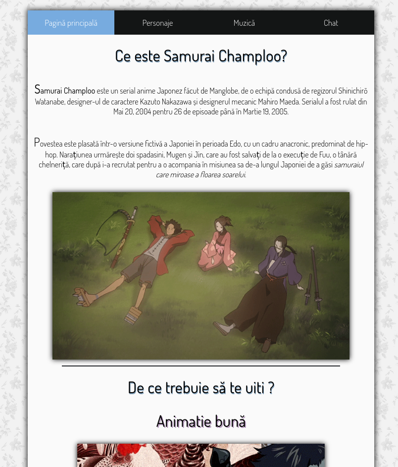
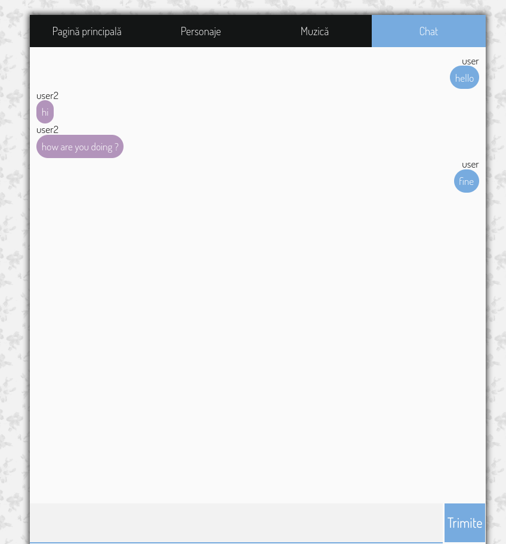

# What is this ? 
This is a small website about my favourite anime: Samurai Champloo. This website is mostly static except chat part. I built a login/registration page + the chat itself using websockets and golang as the backend language.
# Screenshots

